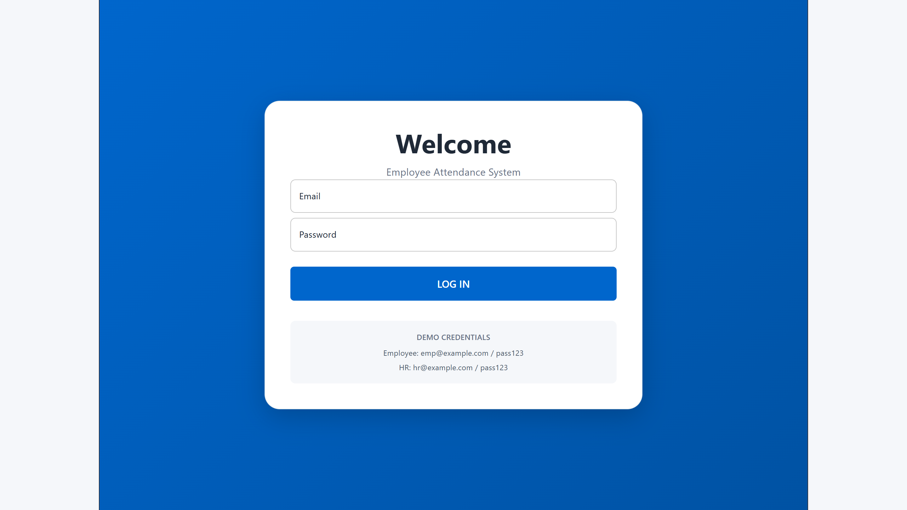
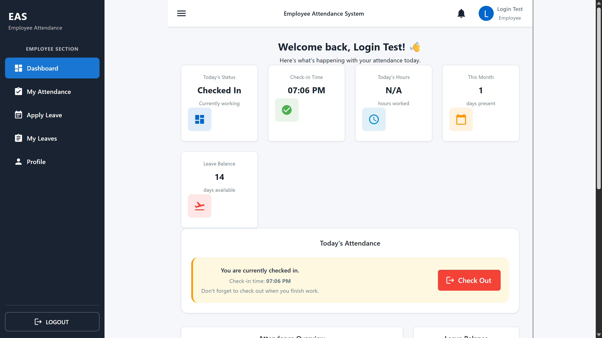
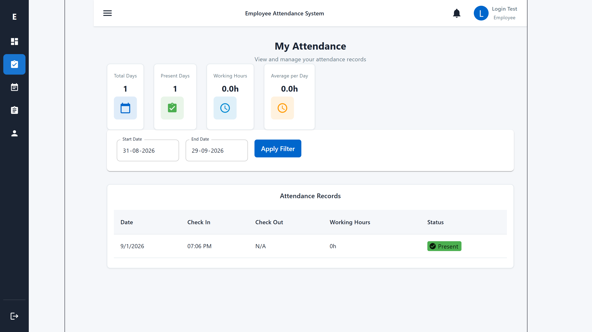
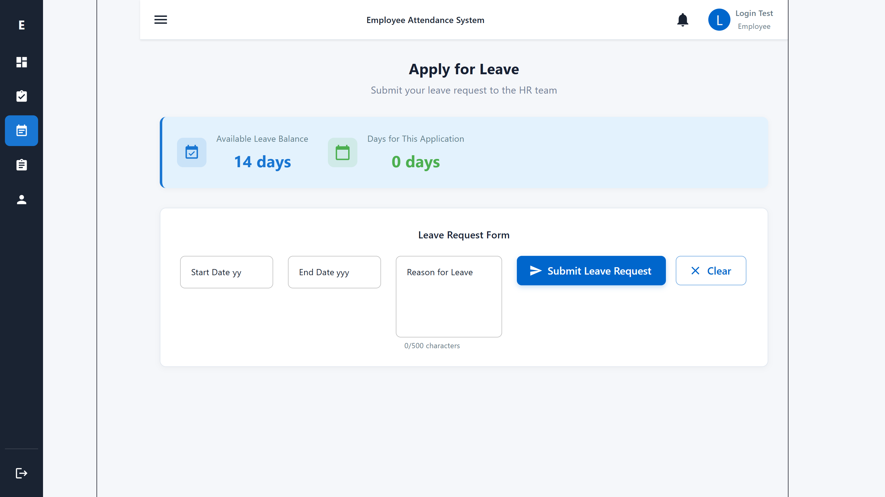
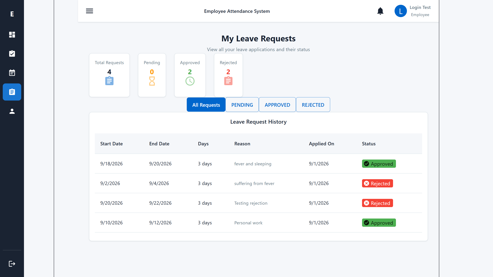
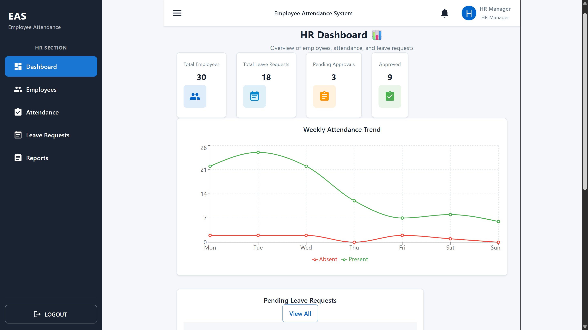
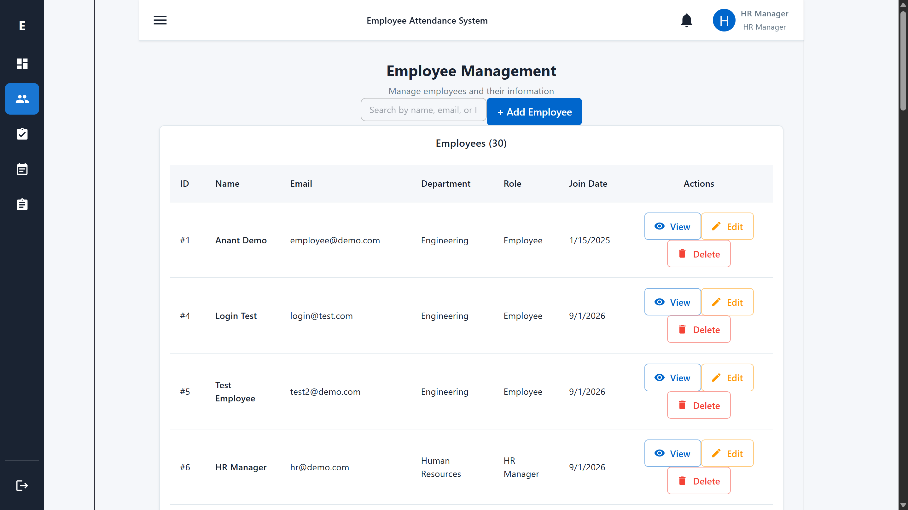
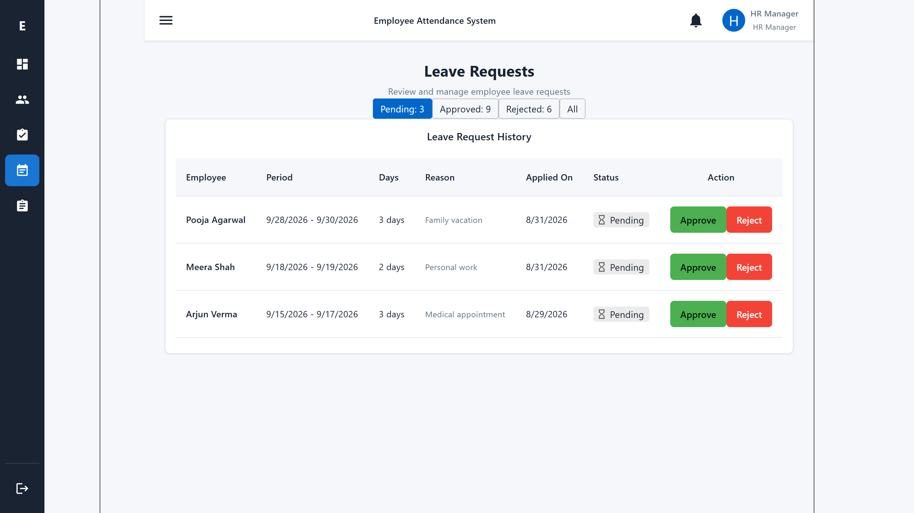
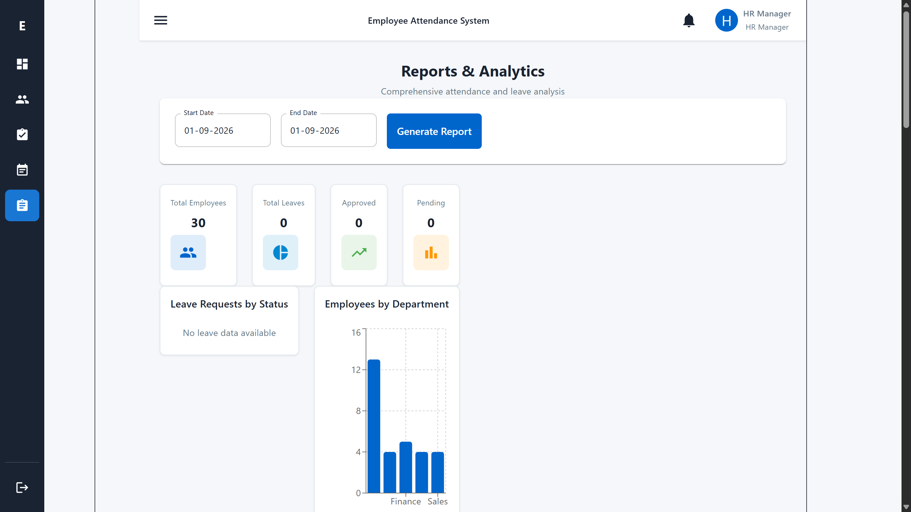

# Employee Attendance System

A full-stack **Employee Attendance & Leave Management System** built with **React, Spring Boot, Spring Security, JWT and MySQL**.

The application provides separate experiences for **Employees** and **HR Managers**, including attendance tracking, leave workflows, employee management, dashboards, and reporting.

---

## 🚀 Live Demo

###  **[OPEN EMPLOYEE ATTENDANCE SYSTEM](https://employee-attendance.up.railway.app/)**

**Live application:** https://employee-attendance.up.railway.app/

Use the demo credentials below to explore both Employee and HR workflows.

### 🔐 Demo Credentials

**Employee**
```text
Email: login@test.com
Password: demo123
```

**HR Manager**
```text
Email: hr@demo.com
Password: hr123
```

> These are demo credentials intended for recruiters/reviewers to explore the application.

---

##  Screenshots

### 🔐 Login


### 👨‍💻 Employee Dashboard


### 📅 My Attendance


### 📝 Apply for Leave


### 📋 My Leave Requests


### 🧑‍💼 HR Dashboard


### 👥 Employee Management


### 📋 HR Leave Requests


### 📊 Reports & Analytics


#  Project Overview

A full-stack **Employee Attendance & Leave Management System** with separate Employee and HR portals.

**Employees:** attendance, check-in/out, leave applications, leave history, profile.

**HR:** employee management, attendance monitoring, leave approval/rejection, reports and analytics.

# 🛠️ Tech Stack

**Frontend:** React, Vite, Material UI, React Router, Axios, Recharts  
**Backend:** Java, Spring Boot, Spring Security, JWT, BCrypt, REST APIs  
**Database:** MySQL  
**Deployment:** Railway + GitHub

# 🔐 Security

- JWT authentication
- Role-based access control
- Stateless Spring Security
- BCrypt password hashing
- Protected REST APIs
- CORS configuration

# 🏗️ Architecture

```text
React + MUI
     ↓
REST API + JWT
     ↓
Spring Boot + Spring Security
     ↓
MySQL
```

# 📂 Project Structure

```text
employee-attendance-system/
├── backend/       # Spring Boot API
├── frontend/      # React application
├── database/      # SQL seed data
├── screenshots/   # Application screenshots
└── README.md
```

# 💻 Run Locally

```bash
git clone https://github.com/aditi-sen-core/employee-attendance-system.git
cd employee-attendance-system
```

Create the `employee_attendance` MySQL database, configure backend database/JWT environment variables, then:

```bash
cd backend
mvn spring-boot:run
```

In another terminal:

```bash
cd frontend
npm install
npm run dev
```

#  What This Project Demonstrates

REST API development • React architecture • JWT authentication • RBAC • CRUD • MySQL integration • Leave workflows • Data visualization • PDF reports • Production deployment

**Repository:** https://github.com/aditi-sen-core/employee-attendance-system
